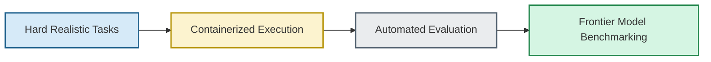
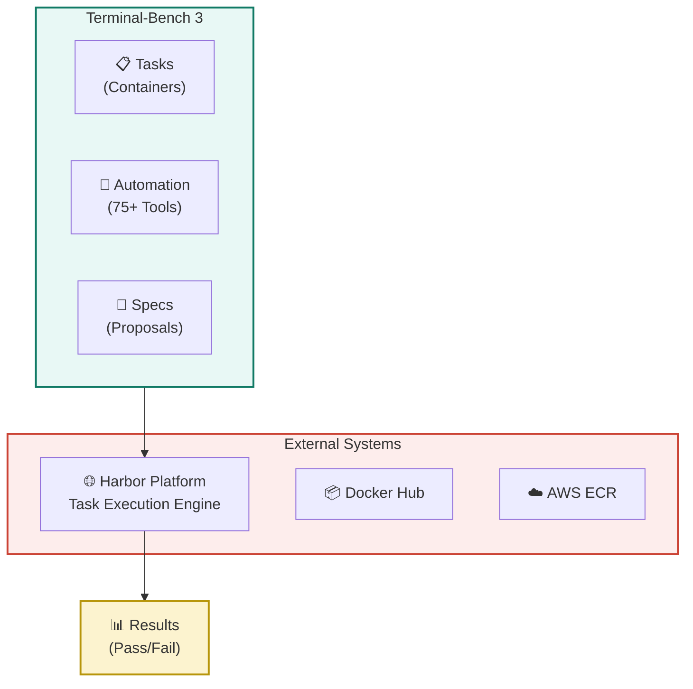
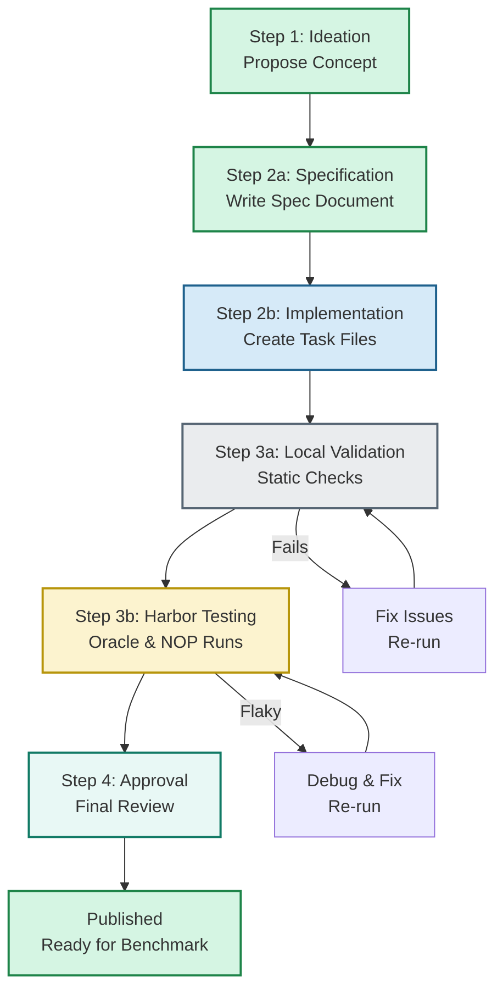
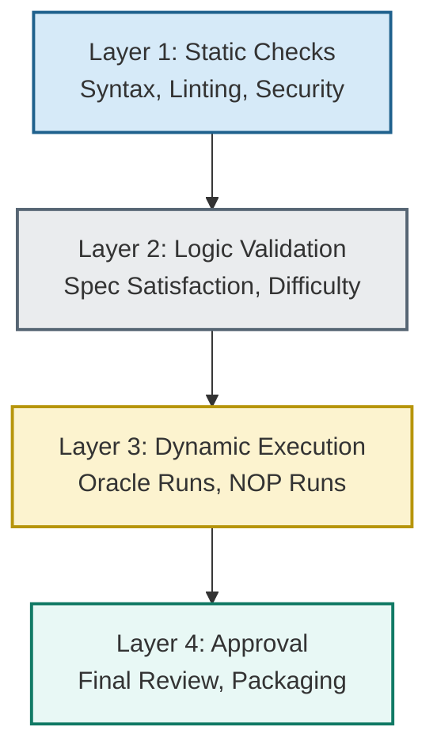

# 🏗️ Terminal-Bench 3: AI Agent Evaluation Platform

A Comprehensive Benchmark Platform for Evaluating AI Agents on Real-World Software Engineering Tasks

---

## Table of Contents
- [Project Purpose](#-project-purpose)
- [What is Terminal-Bench 3?](#-what-is-terminal-bench-3)
- [System Architecture](#%EF%B8%8F-system-architecture)
- [Task Design Principles: "Hard But Fair"](#-task-design-principles-hard-but-fair)
- [Technical Constraints & Environment Rules](#-technical-constraints--environment-rules)
- [Verifier & Test Suite Specifications](#-verifier--test-suite-specifications)
- [Task Lifecycle: From Concept to Benchmark](#-task-lifecycle-from-concept-to-benchmark)
- [The 4-Layer Validation System](#%EF%B8%8F-the-4-layer-validation-system)
- [Empirical Difficulty & Benchmark Models](#-empirical-difficulty--benchmark-models)
- [Getting Started](#-getting-started)
- [Essential Resources](#-essential-resources)

---

## 🎯 Project Purpose

> [!NOTE]
> **Terminal-Bench 3 (TB3)** is a structured benchmark platform designed to rigorously evaluate whether AI agents, language models, and autonomous systems can successfully complete **realistic, hard software engineering tasks** in isolated, containerized environments.
>
> Unlike simplistic benchmarks that test isolated code snippets, TB3 evaluates end-to-end problem-solving in a realistic terminal environment—exactly how human engineers work.

### Why This Matters
- **Frontier Model Evaluation:** Measure true AI capability on hard, realistic problems—not toy examples
- **Safe Isolation:** Run untrusted code in containers with strict resource limits and sandboxing
- **Reproducibility:** Every task runs the same way every time across different machines
- **Scalability:** Automated validation allows testing thousands of agent executions
- **Real-World Relevance:** Tasks mirror actual software engineering work: debugging, refactoring, building features

> [!TIP]
> 💡 **Key Insight:** TB3 is designed to be "Hard But Fair"—every tested requirement is revealed, but the implementation path is hidden. This balances actionability with legitimate challenge.

---

## 📚 What is Terminal-Bench 3?

### Core Concept
Terminal-Bench 3 is a collection of **containerized software engineering tasks** that evaluate AI agent capabilities. Each task includes:
- **Clear Instructions:** What needs to be accomplished (public spec)
- **Complete Environment:** Pre-configured Docker container with all dependencies
- **Success Criteria:** Exact definition of what "solved" means
- **Automated Verifier:** Test suite that checks if the solution is correct
- **Reference Solution:** Proof that the task is solvable

### System Overview

> [!NOTE]
> **The Flow:** Real tasks run in isolated containers. An automated evaluation engine (Harbor) executes AI agents against these tasks, collecting metrics on success rate, resource usage, and runtime behavior. Results feed into benchmarks measuring frontier model capabilities.

### Why Containers?
- 🔒 **Security:** Untrusted code can't escape the sandbox
- 📦 **Reproducibility:** Same environment every run, every machine
- 🎯 **Control:** Strict CPU, memory, disk, and network limits
- ⏱️ **Timeout Enforcement:** Tasks terminate if they exceed time limits

---

## 🏗️ System Architecture

### High-Level Ecosystem

> [!NOTE]
> **Repository Structure:**
> - `tasks/` - Actual task definitions with containers and tests
> - `specs/` - Task proposals before implementation (design phase)
> - `scripts/` - Automation tools for validation and packaging
> - `docs/` - Policies, guides, and this documentation
> - `.github/` - CI/CD pipelines for platform integrity

### Key Statistics

| Published Tasks | Automation Scripts | Validation Layers | Accepted Categories | Category Profiles | Language Families |
| :---: | :---: | :---: | :---: | :---: | :---: |
| **16+** | **75+** | **4** | **6** | **10** | **8** |

---

## 🎯 Task Design Principles: "Hard But Fair"

To ensure rigorous and unbiased evaluation, all tasks must adhere to the **Hard-But-Fair** policy:

### 1. The Central Law
* `instruction.md` must reveal **every externally tested requirement**.
* `instruction.md` must **not** reveal the **implementation patch**.

### 2. Actionability vs. Leakiness Bounds
* **Actionability Bound:** The task instructions and environment code must provide enough detail for an expert human engineer to define success without looking at the tests. Formulas, schemas, inputs, and commands under test must be visible.
* **Leakiness Bound:** The task must not provide step-by-step recipes, name specific fix locations (files, classes, functions), include answer-key booleans, or use rare patch-specific words that turn the task into a simple keyword-grep exercise.

### 3. The 11 Hardness Mechanisms
Very-hard tasks must combine **at least four** distinct allowed mechanisms from the research taxonomy (and document them in the `difficulty_mechanism_plan`):
1. **Buried Local Constraints:** Current specs or logs override more obvious stale material.
2. **Stateful Multi-Step Dependencies:** Later outcomes depend on earlier persisted state, DB rows, or migrations.
3. **Deceptive but Valid Local Evidence:** Plausible but incomplete/stale evidence that doesn't contradict the prompt.
4. **Environment-Specific CLI Semantics:** Core behavior depends on BusyBox-vs-GNU, locales, or symlinks.
5. **False-Green Intermediate States:** Rebuilds or compilation pass before semantic invariants are satisfied.
6. **Partial-Observability Experiment Design:** Solvers must design micro-experiments to isolate causes.
7. **Multi-Container/Local Protocol Constraints:** Local sidecars, pagination, cursor state, or auth boundaries.
8. **Rare Local Vocabulary:** Local domain jargon makes search challenging but exists in the environment.
9. **Rollback & Recovery Requirements:** Persistent state, checkpoints, or cleanup must survive the fix.
10. **Cross-File/Cross-Format Invariants:** In-sync requirements across code, config files, DB schemas, and docs.
11. **Multi-Agent Decomposition Pressure:** Subproblems interact, rendering single-pass local edits fragile.

> [!WARNING]
> ⚠️ **Forbidden Mechanism:** Latency, throughput, and hardware-dependent timing thresholds are strictly forbidden.

### 4. Blocked Categories & Languages
For new task submissions, the following restrictions are strictly enforced:
* 🚫 **Blocked Categories:** The categories `software-engineering`, `debugging`, and `data-processing` are permanently blocked. New tasks must map to one of the 6 accepted categories: `system-administration`, `build-and-dependency-management`, `games`, `machine-learning`, `security`, or `scientific-computing`.
* 🚫 **Language Restriction:** Python is no longer allowed as a task implementation language for new submissions. All new tasks must be implemented in one of the other 8 accepted language families (e.g., Go, Rust, C/C++, JS/TS, Java, Ruby, Bash, etc.).

---

## ⚙️ Technical Constraints & Environment Rules

Tasks must run in completely isolated, containerized environments:

* **No Internet at Runtime:** `allow_internet = false` is enforced in `task.toml`. Downloading packages or code during agent or verifier phases will cause validation failures.
* **Pre-Baked Dependencies:** All dependencies, runtime binaries, and verification tools (e.g., `pytest`) must be installed in `environment/Dockerfile` during the build phase.
* **Canonical Base Images:** Tasks should target the 10 ECR canonical runtime base images (Python, Node, Go, Rust, Java, GCC, Ruby, Maven, Debian, Ubuntu). Custom images must contain a comment in the Dockerfile justifying their use.
* **Required Packages:** Every Dockerfile must install `tmux` and `asciinema` to enable evaluation session recording.
* **Digest Pinning:** Every `FROM` stage in the Dockerfile must use digest-pinned (`@sha256:...`) base images. System packages (`apt`) and language libraries must also use explicit version pinning.
* **Context Size Limit:** `environment/` must be ≤ 100 MiB, and no single file can exceed 50 MiB.
* **AI Scaffolding File Bans:** Filenames like `CLAUDE.md`, `AGENTS.md`, `skills.md`, or folders like `.cursor/`, `.aider/`, `.claude/`, and `.continue/` are strictly banned from submission archives at any depth.

---

## 🧪 Verifier & Test Suite Specifications

* **Exit Status Independence:** The evaluation harness does not read the exit code of `tests/test.sh`. Success is checked solely via the output of `/logs/verifier/reward.txt`, which must contain exactly `1` (pass) or `0` (fail).
* **No `set -e` in `test.sh`:** Do not set exit-on-error behavior before running tests, as a single test failure will abort the script before the reward footer can write `0` to `reward.txt`.
* **Identical Test Conditions:** Oracle and agent runs must execute under identical environment test conditions (no oracle-only branches).
* **Property-Based Assertions:** Test verification should check domain-correct computed values, round-trips, cross-run invariants, or database rows, rather than relying on brittle string checks or boolean answer keys.
* **Pytest CTRF Logs:** Verifiers must output test metrics to `/logs/verifier/ctrf.json` using `pytest --ctrf`.

---

## 🔄 Task Lifecycle: From Concept to Benchmark

Creating a task is a rigorous, multi-step process. Each phase has quality gates that ensure only high-quality, fair, and solvable tasks are published.

### Phase Details

#### Step 1: Ideation 💡
A task creator proposes a concept. What problem does this task test? What skills must an AI agent have to solve it?
* 🚀 **Workflow Prompt:** [prompts/Step1.md](file:///c:/Users/kusha/OneDrive/Desktop/Projects/Dawgs/Terminal-main/prompts/Step1.md)

#### Step 2a: Specification 📝
Before building the full task, a detailed specification is written. This is a proposal document that defines the requirements, expected difficulty, test approach, and success criteria.
* 🚀 **Workflow Prompt:** [prompts/step2a.md](file:///c:/Users/kusha/OneDrive/Desktop/Projects/Dawgs/Terminal-main/prompts/step2a.md)
* 🚀 **Difficulty Calibration:** [prompts/step2a_difficulty.md](file:///c:/Users/kusha/OneDrive/Desktop/Projects/Dawgs/Terminal-main/prompts/step2a_difficulty.md)

#### Step 2b: Implementation 🛠️
The actual task is created with the Docker container environment, public instructions, success contract, test suite, and reference solution.
* 🚀 **Workflow Prompt:** [prompts/Step2b.md](file:///c:/Users/kusha/OneDrive/Desktop/Projects/Dawgs/Terminal-main/prompts/Step2b.md)

#### Step 3: Validation ✅
* **3a - Local Gates:** Run static checks (linting, syntax validation, security scanning).
  * 🚀 **Workflow Prompt:** [prompts/step3a.md](file:///c:/Users/kusha/OneDrive/Desktop/Projects/Dawgs/Terminal-main/prompts/step3a.md)
* **3b - Harbor Platform:** Execute the task against the reference solution (Oracle run) and without it (NOP run). Tests must pass with solution, fail without.
  * 🚀 **Workflow Prompt:** [prompts/step3b.md](file:///c:/Users/kusha/OneDrive/Desktop/Projects/Dawgs/Terminal-main/prompts/step3b.md)
  * 🚀 **If Task is Too Easy / Redesign:** [prompts/difficulty_increase.md](file:///c:/Users/kusha/OneDrive/Desktop/Projects/Dawgs/Terminal-main/prompts/difficulty_increase.md) or [prompts/difficulty_redesign.md](file:///c:/Users/kusha/OneDrive/Desktop/Projects/Dawgs/Terminal-main/prompts/difficulty_redesign.md)

#### Step 4: Approval & Packaging 🔐
Final review by maintainers. Check for fairness, clarity, and alignment with platform policies. The task is then packaged into a submission-ready ZIP file.
* 🚀 **Workflow Prompts:** [prompts/step4.md](file:///c:/Users/kusha/OneDrive/Desktop/Projects/Dawgs/Terminal-main/prompts/step4.md), [prompts/Step5.md](file:///c:/Users/kusha/OneDrive/Desktop/Projects/Dawgs/Terminal-main/prompts/Step5.md), and [prompts/Step6.md](file:///c:/Users/kusha/OneDrive/Desktop/Projects/Dawgs/Terminal-main/prompts/Step6.md)

#### Published 🚀
Task is packaged and published for use in benchmarks.

---

## 🛡️ The 4-Layer Validation System

Terminal-Bench 3 uses a rigorous, multi-layer validation system to ensure only high-quality tasks are published. Each layer catches different types of issues.

### Layer 1: Static Checks 🔍
**Purpose:** Catch syntactic and security issues without running code
- Dockerfile validation (pinned base images, security best practices)
- TOML/JSON syntax checking
- Obfuscation detection (catch hidden malicious code)
- Size limits enforcement (Docker image ≤ 100MB)

### Layer 2: Logic Validation 📋
**Purpose:** Verify task design meets specification and difficulty requirements
- Spec satisfaction checks (is implementation faithful to spec?)
- Difficulty estimation (Hard/Medium/Easy classification)
- Language diversity validation (multi-language benchmark)
- Policy compliance (Hard-But-Fair principle, timeouts, etc.)

### Layer 3: Dynamic Execution 🚀
**Purpose:** Test task in actual execution environment
- **Oracle Run:** Execute with reference solution—tests MUST PASS
- **NOP Run:** Execute WITHOUT solution—tests MUST FAIL
- **Flakiness Detection:** Run multiple times to catch non-determinism
- **Performance Validation:** Ensure task completes within timeout

### Layer 4: Approval 🔐
**Purpose:** Final human review and packaging
- Readability review (are instructions clear?)
- Fairness check (is it solvable? Is it leaky?)
- Checksum verification (proof of approval)
- Package creation (ZIP distribution)

---

## 📊 Empirical Difficulty & Benchmark Models

Platform classification is determined post-upload based on evaluations from two frontier models: **GPT-5.5** and **Claude Opus 4.8** (5 runs each).

| Label | Rule | Stance |
| :--- | :--- | :--- |
| **HARD** | Accuracy **≤ 20%** on the **best** model, or **≤ 20%** on the **worst** model | **Target** — Target empirical difficulty for all new tasks |
| **MEDIUM** | **20% < worst-model accuracy ≤ 60%** | Allowed only for select non-Python tasks |
| **EASY** | **60% < worst-model accuracy ≤ 80%** | **Rejected** |
| **REJECT** | **worst-model accuracy > 80%** | **Blocked** |

* **Language Restriction:** Python is no longer allowed as a task implementation language for new submissions (all new tasks must use one of the other 8 accepted language families).

---

## 🚀 Getting Started

### For Task Creators
Want to contribute a task? Follow this roadmap:

| Phase | What You Do | Key Files |
| :--- | :--- | :--- |
| **1. Plan** | Define your task concept and difficulty | `docs/HARD_BUT_FAIR_AUTHORING.md` |
| **2. Specify** | Write a detailed spec document | `specs/your-task.md` |
| **3. Build** | Create task files and Docker container | `tasks/your-task/` |
| **4. Validate Locally** | Run `check-task.sh`, fix issues | `scripts/check-task.sh` |
| **5. Submit to Harbor** | Run Oracle and NOP verification | `scripts/harbor_gate.py` |
| **6. Get Approved** | Address feedback, final approval | `scripts/approve_task.py` |

### Key Commands

> [!IMPORTANT]
> * 📌 `python3 scripts/tb3_doctor.py` - Check repository tool sanity
> * 📌 `./scripts/check-task.sh --strict tasks/<task>` - Run local validation and write `.step2b-checksum`
> * 📌 `python3 scripts/harbor_gate.py tasks/<task> --oracle --nop` - Run dynamic Oracle/NOP verification
> * 📌 `python3 scripts/harbor_gate.py tasks/<task> --oracle-repeat 10` - Flakiness/Stress run
> * 📌 `python3 scripts/package_task.py tasks/<task> --out Task_Ready_To_Submit/<task>.zip --validate` - Package zip
> * 📌 `python3 scripts/approve_task.py --strict` - Authoritative approval gate run

> [!WARNING]
> 🖥️ **Windows & WSL2 Execution Requirement:** For developers on Windows, all Docker-based operations (such as Harbor dynamic runs, Oracle/NOP verification, and package testing) **must be executed inside WSL (Windows Subsystem for Linux)**.
> * Always run commands from the WSL mount path of the repository root (e.g., `/mnt/c/Users/.../Terminal-main`).
> * Ensure you are using the native Linux Docker context (`docker context use default` pointing to `unix:///var/run/docker.sock`) rather than `desktop-linux` to prevent socket or bind-mount compatibility errors.

---

## 🛡️ Auditable Waiver Framework

Waivers are exceptional, auditable approvals for narrow checker finding false-positives.

* **Usually Waivable (with evidence):** Real-world path predictability (RC2), symptom-causation density (GX6), broad stem collisions (CR1/CR7), and localized bug frontiers.
* **Blocked in Final Approval:** Contract saturation (GX9), central orchestrators (CR8), and broad symbol-frontier issues.
* **Never Waivable:** Oracle failures, NOP successes, actionability failures, hidden contract failures, obfuscation/gaming, or missing source-fix disclosures.

---

## 📚 Essential Resources

### Documentation
- [HARD_BUT_FAIR_AUTHORING.md](file:///c:/Users/kusha/OneDrive/Desktop/Projects/Dawgs/Terminal-main/docs/HARD_BUT_FAIR_AUTHORING.md) - Core design principles & actionability policy
- [ARCHITECTURE.md](file:///c:/Users/kusha/OneDrive/Desktop/Projects/Dawgs/Terminal-main/docs/ARCHITECTURE.md) - System architecture, layer mapping, and codebase structure
- [commands.md](file:///c:/Users/kusha/OneDrive/Desktop/Projects/Dawgs/Terminal-main/commands.md) - Complete command reference for all gates and harbor execution
- [AGENTS.md](file:///c:/Users/kusha/OneDrive/Desktop/Projects/Dawgs/Terminal-main/AGENTS.md) - Operational guidelines and strict checklist for agents
- [REPO_CONVENTIONS.md](file:///c:/Users/kusha/OneDrive/Desktop/Projects/Dawgs/Terminal-main/REPO_CONVENTIONS.md) - Repository-specific design rules, file structures, and templates
- [WAIVERS.md](file:///c:/Users/kusha/OneDrive/Desktop/Projects/Dawgs/Terminal-main/docs/WAIVERS.md) - Auditable waivers policy and schema rules
- [EDITION2_SUBMISSION_GUIDE.md](file:///c:/Users/kusha/OneDrive/Desktop/Projects/Dawgs/Terminal-main/docs/EDITION2_SUBMISSION_GUIDE.md) - Edition 2 submission guidelines, platform models, and timeouts
- [PORTAL_ACCEPTANCE_GUIDE.md](file:///c:/Users/kusha/OneDrive/Desktop/Projects/Dawgs/Terminal-main/docs/PORTAL_ACCEPTANCE_GUIDE.md) - Portal acceptance checklist and review categories
- [PLATFORM_AUTO_EVAL.md](file:///c:/Users/kusha/OneDrive/Desktop/Projects/Dawgs/Terminal-main/docs/PLATFORM_AUTO_EVAL.md) - Auto-eval troubleshooting and Dockerfile/verifier patterns
- [CATEGORY_PROFILES.md](file:///c:/Users/kusha/OneDrive/Desktop/Projects/Dawgs/Terminal-main/docs/CATEGORY_PROFILES.md) - Specifications for all task category profiles
- [FAILURE_CATALOG.md](file:///c:/Users/kusha/OneDrive/Desktop/Projects/Dawgs/Terminal-main/docs/FAILURE_CATALOG.md) - Closed-loop postmortem structure and lessons
- [FIRST_LOOK_DRY_RUN.md](file:///c:/Users/kusha/OneDrive/Desktop/Projects/Dawgs/Terminal-main/docs/FIRST_LOOK_DRY_RUN.md) - First-look dry-run prompt and pass/fail criteria
- [HARD_TASK_RESEARCH_PATTERNS.md](file:///c:/Users/kusha/OneDrive/Desktop/Projects/Dawgs/Terminal-main/docs/HARD_TASK_RESEARCH_PATTERNS.md) - Taxonomy of hardness mechanisms and scoring plan
- [TASK_PROPOSAL_RUBRIC.md](file:///c:/Users/kusha/OneDrive/Desktop/Projects/Dawgs/Terminal-main/TASK_PROPOSAL_RUBRIC.md) - Guidelines for creating task evaluation rubrics

### Workflow Prompts
- [Step1.md](file:///c:/Users/kusha/OneDrive/Desktop/Projects/Dawgs/Terminal-main/prompts/Step1.md) - Step 1: Idea Generation
- [step2a.md](file:///c:/Users/kusha/OneDrive/Desktop/Projects/Dawgs/Terminal-main/prompts/step2a.md) - Step 2a: Specification Prompt
- [step2a_difficulty.md](file:///c:/Users/kusha/OneDrive/Desktop/Projects/Dawgs/Terminal-main/prompts/step2a_difficulty.md) - Step 2a: Difficulty Calibration Prompt
- [Step2b.md](file:///c:/Users/kusha/OneDrive/Desktop/Projects/Dawgs/Terminal-main/prompts/Step2b.md) - Step 2b: Task Implementation Prompt
- [step3a.md](file:///c:/Users/kusha/OneDrive/Desktop/Projects/Dawgs/Terminal-main/prompts/step3a.md) - Step 3a: Local Check Prompt
- [step3b.md](file:///c:/Users/kusha/OneDrive/Desktop/Projects/Dawgs/Terminal-main/prompts/step3b.md) - Step 3b: Harbor Validation Prompt
- [difficulty_increase.md](file:///c:/Users/kusha/OneDrive/Desktop/Projects/Dawgs/Terminal-main/prompts/difficulty_increase.md) - Prompt to increase task difficulty
- [difficulty_redesign.md](file:///c:/Users/kusha/OneDrive/Desktop/Projects/Dawgs/Terminal-main/prompts/difficulty_redesign.md) - Prompt to redesign task for higher difficulty
- [step4.md](file:///c:/Users/kusha/OneDrive/Desktop/Projects/Dawgs/Terminal-main/prompts/step4.md) - Step 4: Approval Prompt
- [Step5.md](file:///c:/Users/kusha/OneDrive/Desktop/Projects/Dawgs/Terminal-main/prompts/Step5.md) - Step 5: Verification Prompt
- [Step6.md](file:///c:/Users/kusha/OneDrive/Desktop/Projects/Dawgs/Terminal-main/prompts/Step6.md) - Step 6: Packaging Prompt

### Playbooks & External Design Prompts (web/)
- [chatgpt-task-authoring-playbook.md](file:///c:/Users/kusha/OneDrive/Desktop/Projects/Dawgs/Terminal-main/web/chatgpt-task-authoring-playbook.md) - Complete playbook for authoring and calibrating tasks with LLMs
- [bulk-idea-generation.md](file:///c:/Users/kusha/OneDrive/Desktop/Projects/Dawgs/Terminal-main/web/bulk-idea-generation.md) - Bulk idea generation (Option B) prompt templates
- [option-a-seed-refinement.md](file:///c:/Users/kusha/OneDrive/Desktop/Projects/Dawgs/Terminal-main/web/option-a-seed-refinement.md) - Seed refinement and consolidation (Option A) templates
- [implementation-collapse-audit.md](file:///c:/Users/kusha/OneDrive/Desktop/Projects/Dawgs/Terminal-main/web/implementation-collapse-audit.md) - Collapse audit guide to catch leakiness in implemented tasks
- [pipeline-resistant-design.md](file:///c:/Users/kusha/OneDrive/Desktop/Projects/Dawgs/Terminal-main/web/pipeline-resistant-design.md) - Guidance on blocking simple verification cheats and command bypasses
- [terminal-bench-task-creation.md](file:///c:/Users/kusha/OneDrive/Desktop/Projects/Dawgs/Terminal-main/web/terminal-bench-task-creation.md) - Coding assistant prompt rules for task creation

### Quality & Review Prompts (prompt_review_task/)
- [quality_prompt.md](file:///c:/Users/kusha/OneDrive/Desktop/Projects/Dawgs/Terminal-main/prompt_review_task/quality_prompt.md) - Guide for repairing axis-level defects identified in quality checks
- [trivial.md](file:///c:/Users/kusha/OneDrive/Desktop/Projects/Dawgs/Terminal-main/prompt_review_task/trivial.md) - Redesign prompt for transforming trivial tasks into platform-HARD ones
- [verifier.md](file:///c:/Users/kusha/OneDrive/Desktop/Projects/Dawgs/Terminal-main/prompt_review_task/verifier.md) - Diagnostic guidelines for assessing flaky or failing verifiers

### Tools & Scripts
- [lint_spec.py](file:///c:/Users/kusha/OneDrive/Desktop/Projects/Dawgs/Terminal-main/scripts/lint_spec.py) - Validate task specifications
- [task_gate.py](file:///c:/Users/kusha/OneDrive/Desktop/Projects/Dawgs/Terminal-main/scripts/task_gate.py) - Quick task validation
- [harbor_gate.py](file:///c:/Users/kusha/OneDrive/Desktop/Projects/Dawgs/Terminal-main/scripts/harbor_gate.py) - Platform execution engine
- [approve_task.py](file:///c:/Users/kusha/OneDrive/Desktop/Projects/Dawgs/Terminal-main/scripts/approve_task.py) - Final approval and checksum
- [collapse_check.py](file:///c:/Users/kusha/OneDrive/Desktop/Projects/Dawgs/Terminal-main/scripts/collapse_check.py) - Hard leakiness and discoverability checker
- [no_hidden_contracts.py](file:///c:/Users/kusha/OneDrive/Desktop/Projects/Dawgs/Terminal-main/scripts/no_hidden_contracts.py) - Assert that all tests verify public requirements

---

## 📋 Task Evaluation & Acceptance Criteria

This section outlines the critical criteria required for evaluating the quality of a Terminus Edition 2 task, highlighting key areas that require human review and/or must pass for a task to be acceptable.

### Severity Guidance
* **High:** If any criterion marked ‘high’ is not met, the task should not be accepted. High severity criteria must always pass for every single task.
* **Medium:** If a task fails multiple ‘medium’ criteria, the task should not be accepted. If the task only fails one ‘medium’ criteria, it is ok to be accepted. In the case of just a single ‘medium’ failure, leave a note in the acceptance comments on what the failure is.
* **Low:** If a task fails only ‘low’ criteria, it is ok to be accepted. These are typically ‘nice to have’, but should not block a submission from being accepted. If a task is to be sent to revision regardless, please include in the revision notes to correct those low severity issues as well.

---

### 1. Instruction Prompt Criteria

| Criterion | Description | Severity |
| :--- | :--- | :---: |
| **Concise Task Instruction** | Task instructions must be concise and clear (1 sentence to 3 paragraphs). They should read like how a human would prompt an agent (no emojis, light markdown). | **High** |
| **Well-Specified Instruction** | Goal must be clear and obvious. If a task is primarily hard due to an excessive number of edge cases, it should be rejected. | **High** |
| **Interesting Instruction** | Every task must be interesting, useful, and relevant to modern software development. | **High** |
| **No Solver Hints** | Instruction must not provide step-by-step walkthroughs, recipes, or hints in `instruction.md`. | **High** |
| **No Environment Hints** | Banned step-by-step walkthroughs or hints in READMEs, comments, or configurations. | **High** |
| **Realistic Specs & Docs** | Environment docs must define only rules/schemas, never split task requirements out of `instruction.md`, and look like realistic engineering files. | **High** |
| **Unique Instruction** | Noticeably unique logic/outcomes compared to previous tasks (TB2, TB3, Snorkel). | **High** |
| **Absolute Paths** | All referenced paths in the instruction must be absolute. | **High** |
| **No Canary Strings** | No leftover placeholder canary strings in `instruction.md`. | **Medium** |
| **No Task Name in Prompt** | The task name must not appear anywhere in `instruction.md` (e.g. as top-line comments). | **Medium** |

---

### 2. Environment Criteria

| Criterion | Description | Severity |
| :--- | :--- | :---: |
| **Offline Dependencies** | Sandbox must not download files from the internet at runtime; all libraries must be bundled. | **High** |
| **allow_internet Accuracy** | `allow_internet` flag must match actual needs. Use false unless internet access is functionally required. | **High** |
| **Pinned Versions** | All installed package/library dependencies must use pinned versions (excludes standard system apt). | **High** |
| **No External Context** | Sandbox must stay fully contained in `environment/` (no docker-compose volume mounts pointing to parent `../`). | **High** |
| **No Shipped Solution** | No oracle solution files or ground truth answers in the environment directory. | **High** |
| **No Dangerous Ops** | Banned privileged docker flags, net/sys admins, and mounting the host docker socket. | **High** |
| **No Conflicting Mounts** | Banned modifying volume mounts reserved for harbor: `/logs/artifacts/`, `/logs/verifier/`, `/tests/`, `/solution/`. | **High** |
| **No AI Scaffolding** | Banned filenames like `CLAUDE.md`, `skills.md`, or folders like `.cursor/` in submission archives. | **High** |
| **Digest-Pinned Images** | Every base image `FROM` line in Dockerfile and docker-compose must include `@sha256:<digest>`. | **High** |
| **Canonical Base Image** | Final runtime stage must use a canonical base image unless a credible justification is commented/documented. | **High** |
| **Small Build Context** | The `environment/` context must be ≤ 100 MiB total, with no single file over 50 MiB. | **High** |
| **Clean Apt Usage** | Single transaction `apt-get update && apt-get install -y --no-install-recommends ... && rm -rf /var/lib/apt/lists/*` per stage. | **Medium** |
| **Dockerignore Exclusions** | Include `.dockerignore` to exclude files like `.git`, `__pycache__/`, `node_modules/`, `solution/`, `tests/`. | **Medium** |
| **Avoid Heredocs** | Preferred that Dockerfiles do not use heredoc syntax (e.g. `cat << EOF`). | **Low** |

---

### 3. Oracle & Verifier Criteria

| Criterion | Description | Severity |
| :--- | :--- | :---: |
| **Flake-Free Oracle** | Oracle solution must pass consistently and avoid latency-based or non-deterministic test failures. | **High** |
| **Oracle Internet Limits** | Oracle's network access must strictly adhere to the `allow_internet` flag settings. | **High** |
| **Oracle Reflects Prompt** | Oracle must implement a true solution described in `instruction.md`, rather than hardcoding answers. | **High** |
| **Reward Assignment** | `test.sh` must always write exactly `1` or `0` to `/logs/verifier/reward.txt` on both success and failure. | **High** |
| **Equivalent Verification** | Oracle and agent runs must be evaluated using the exact same logic. | **High** |
| **Binary Rewards** | Scores assigned to `reward.txt` must be strictly `1` or `0` (no partial credits). | **High** |
| **Verified Requirements** | Verifiers must only assert requirements explicitly/implicitly defined in instructions. | **High** |
| **Correctness Over Format** | Verifiers must check actual logical correctness rather than mere output structures or formats. | **High** |

---

### 4. Rubric Criteria

| Criterion | Description | Severity |
| :--- | :--- | :---: |
| **No Testing References** | Rubric must not reference files in `/tests/` or evaluate test execution outcomes. | **High** |
| **No Metadata References** | Rubric must not reference `task.toml` or `instruction.md` (which are invisible to the agent). | **High** |
| **Negative Penalties** | Rubric must contain at least 3 negative criteria (assigning negative rewards like -1) for harmful model actions. | **High** |
| **Standardized Scores** | Rubric scores must belong to the set: `+1, +2, +3, +5, -1, -2, -3, -5`. | **High** |
| **Explicit Signs** | Every positive rubric score must have a leading plus sign (e.g., `+1` or `+3`, not bare `1` or `3`). | **High** |
| **Block Formatting** | Standard one-line-per-criterion format, beginning with 'Agent' and ending with ', score'. | **High** |
| **Precise Criteria** | Criteria must describe specific, observable, and precise actions to grade. | **High** |
| **Negative Criterion** | Each milestone rubric must have at least one negative criterion. | **Medium** |
| **Mapped Importance** | Critical criteria mapped to `±5`, major/minor mapped to less extreme scores. | **Medium** |
| **Positive Phrasing** | Rephrase negative statements positively with negative rewards (e.g., 'Agent accesses secret, -1'). | **Medium** |
| **No Oracle Mentions** | Rubric must not mention NOP or oracle run results. | **Medium** |
| **Point Boundaries** | Milestones must fall between 10 and 40 total points. | **Low** |

---

### 5. Task & Milestone Structure

| Criterion | Description | Severity |
| :--- | :--- | :---: |
| **Required Files** | Non-milestone: `environment/`, `solution/`, `tests/`, `instruction.md`, `task.toml`. Milestone: steps layout. | **High** |
| **2+ Milestones** | Milestone tasks must declare 2 or more milestones in `task.toml` and their respective directories. | **High** |
| **Steps Layout** | Milestone tasks must isolate per-milestone prompt/solution/tests inside `steps/milestone_N/` subdirs. | **High** |
| **Steps TOML Declaration** | `task.toml` must declare one `[[steps]]` block with matching `name` and timeouts per milestone. | **High** |
| **Milestone Solutions** | Each milestone must have `steps/milestone_N/solution/solveN.sh` and its `solve.sh` wrapper. | **High** |
| **Milestone Tests** | Each milestone must have `steps/milestone_N/tests/test_mN.py` and its `test.sh` wrapper. | **High** |
| **Focused Prompts** | Milestone instruction prompts must only describe requirements relevant to that milestone. | **High** |
| **Workspace Cleanup** | Parent directory must be free of unnecessary temporary directories or files (like `jobs/`, `README.md`). | **Low** |

---

&copy; 2026 Terminal-Bench 3 | AI Agent Evaluation Platform

This documentation provides a comprehensive overview of the Terminal-Bench 3 project, its architecture, and how to create high-quality benchmark tasks.

